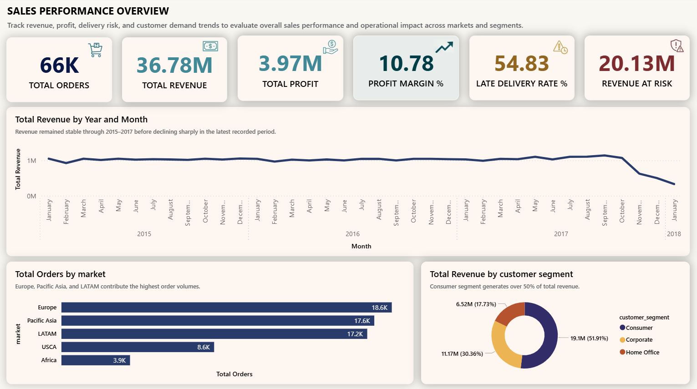
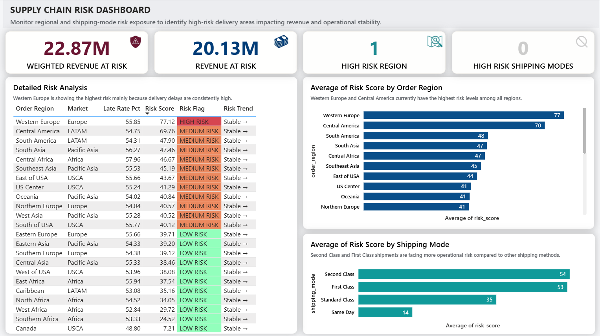
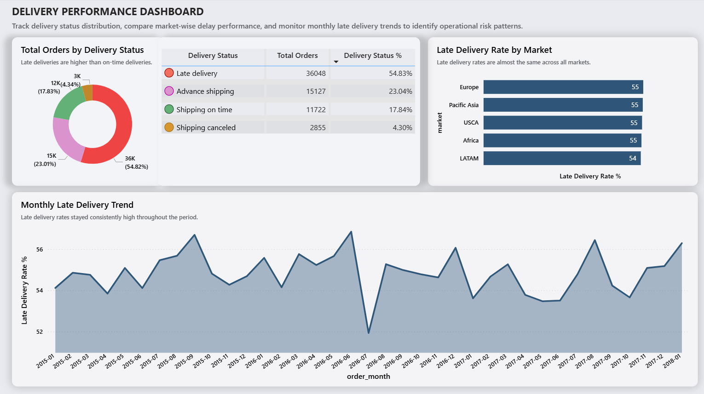
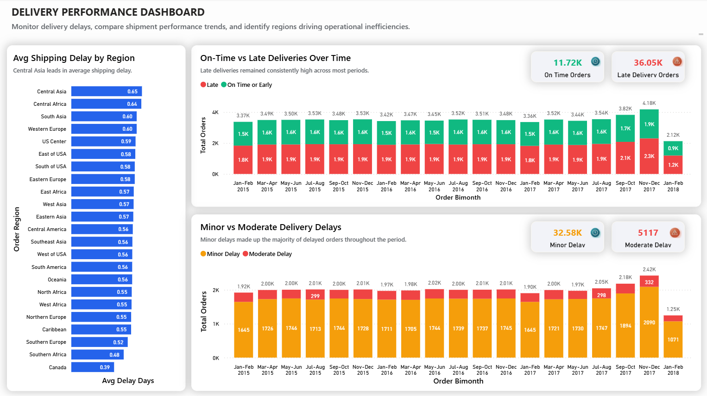
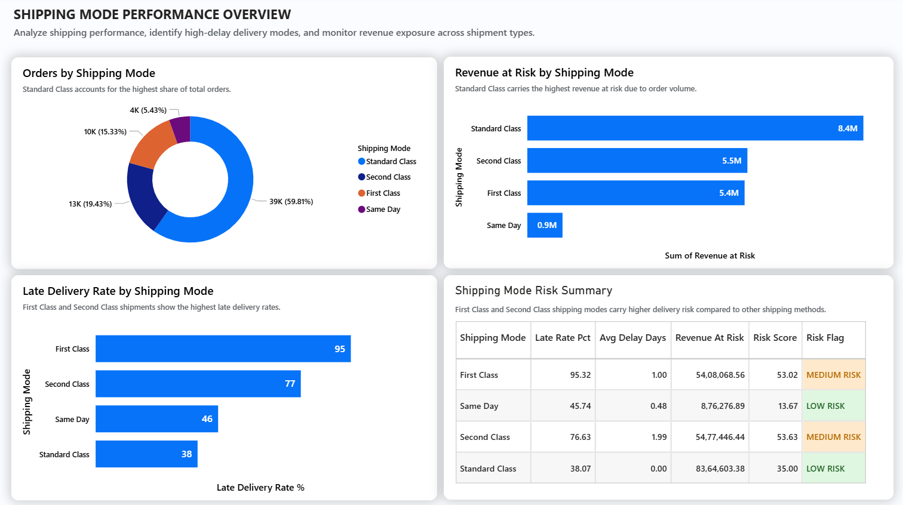
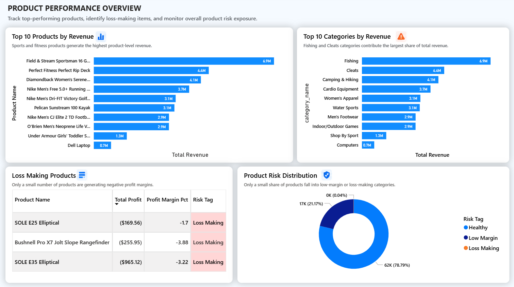
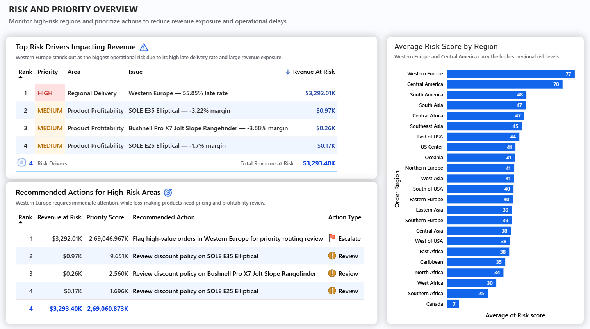

<div align="center">

# Supply Chain Risk & Performance Decision Dashboard

**SQL + Python + Power BI | DataCo SMART Supply Chain Dataset**

This project focuses on how supply chain teams can use data to identify operational risk, prioritize problems, and decide where to act first.




</div>

---

## The Short Version

180,519 supply chain orders. $36.78M in revenue. 54.83% late delivery rate.

More than half of all orders arrive late. $20.13M in revenue is directly at risk from late deliveries. Western Europe scores as the single highest-risk region — combining a 55.85% late rate with $3.29M in exposed revenue. First Class shipping has a 95.32% late delivery rate despite being a premium tier.

The dashboard converts these metrics into ranked operational priorities — helping identify which regions, shipping modes, and products need attention first.

---

## Key Outcomes

- Built a 7-page Power BI decision dashboard covering delivery, shipping, product, and action layers
- Created a weighted 4-factor risk scoring model using Python — normalized across 23 regions and 4 shipping modes
- Identified $20.13M in revenue exposure from late deliveries ($22.87M weighted)
- Ranked all regions and shipping modes by urgency using financial exposure, not just late rate
- Converted risk scores into a ranked action-priority table with specific data-linked recommendations

---

## What Makes This Project Different

Most dashboards stop at showing KPIs. This project goes further.

It calculates risk scores, ranks regions and shipping modes by urgency, and creates an action table that tells the manager where to focus first.

The goal is not reporting. The goal is decision support.

---

## The Core Problem

Supply chain managers need more than dashboards.

Knowing that Western Europe has a high late rate is not enough. You need to know whether that late rate — combined with the revenue at stake and the delay severity — makes it more urgent than ten other regions with similar numbers.

This project builds that system. SQL extracts the metrics. Python converts them into weighted risk scores and a ranked action table. Power BI makes the output visible.

---

## Dashboard Preview

### Executive Summary


### Risk Overview


### Delivery Performance


### Delay Analysis


### Shipping Mode Analysis


### Product Risk


### Action Dashboard


---

## How This System Works

```
SQL
└── Extracts raw business metrics
    (delivery rates, profit, region performance, shipping mode data)

Python
└── Converts metrics into weighted risk scores
    (4-factor formula, normalized 0–100)
    └── Outputs 5 dashboard-ready tables

Power BI
└── Visualizes risk signals and recommended actions
    (7-page decision dashboard)
```

Every SQL query feeds Python. Every Python output feeds Power BI.
The system flows: **Extract → Score → Prioritize → Act**

```
Raw Dataset (180,519 rows | 53 columns)
         ↓
  MySQL — Data loading and validation
         ↓
  Python 01 — Cleaning and column selection
         ↓
  Python 02 — Feature engineering (delay severity, weighted risk)
         ↓
  Python 03 — Risk scoring (4-factor formula, normalized 0–100)
         ↓
  Python 04 — Action priority table (ranked by financial exposure)
         ↓
  CSV Output Tables (5 files → data/cleaned/)
         ↓
  Power BI — 7-page decision dashboard
```

---

## Key Business Insights

**Insight 1 — More than half of all orders arrive late**

54.83% of all orders are classified as late delivery — and this rate has remained consistently high across every bi-monthly period from 2015 to 2018. It is not a seasonal spike or a one-region problem. Every market sits between 54% and 56% late delivery rate. This indicates a broad operational delivery issue rather than an isolated regional problem.

**Insight 2 — Western Europe is the highest-risk region**

Western Europe scores 77.12 on the weighted risk index — significantly ahead of Central America at 69.76. The combination of a 55.85% late rate and $3.29M in revenue at risk puts it in a category of its own. Every other region scores below 50. The risk is not evenly distributed — it is concentrated.

**Insight 3 — First Class has the worst delivery performance**

First Class shipping has a 95.32% late delivery rate — nearly every order in this tier arrives late. Standard Class, handling 59.81% of all orders, has the lowest late rate at 38.07% but carries $8.4M in revenue at risk purely because of volume. Each shipping mode shows a different operational risk pattern and requires a different response strategy.

**Insight 4 — $20.13M in revenue is exposed to late delivery risk**

$20.13M out of $36.78M in total revenue — 54.7% — comes from orders flagged as late delivery risk. When delay severity is factored in using a weighted multiplier, the weighted revenue at risk rises to $22.87M. The simple metric understates the true financial exposure.

**Insight 5 — Loss-making products are quietly destroying margin**

Three products generate negative profit: SOLE E35 Elliptical (-$965), Bushnell Pro X7 Jolt Slope Rangefinder (-$256), and SOLE E25 Elliptical (-$170). These are small in absolute terms but point to a discount structure problem. At item level, 33,784 records (18.71% of the dataset) show negative profit after discounts are applied.

---

## Business Recommendations

**1. Investigate Western Europe logistics immediately**

Western Europe has the highest risk score in the dataset (77.12) with $3.29M in revenue at risk and a 55.85% late delivery rate. This region should be the first conversation with the logistics team. If the late rate cannot be brought below 40% in the next review cycle, evaluating alternative carriers for this lane is worth considering.

**2. Review First Class shipping SLA**

A 95.32% late rate on a premium shipping tier indicates a major service reliability issue. Customers paying for First Class expect faster delivery, not slower. The carrier SLA for First Class needs to be reviewed. High-value orders currently routed through First Class should be evaluated for whether the tier is delivering on its promise.

**3. Fix the discount structure on loss-making products**

Three products are generating negative profit. The root cause in each case is discount policy — not demand. Removing or capping discounts on these products is the first step. If margin cannot be recovered after the discount review, phasing them out is the correct next move.

**4. Use weighted revenue at risk as the primary risk KPI**

The simple revenue at risk figure ($20.13M) undercounts true exposure because it treats a 1-day delay the same as a 5-day delay. The weighted version ($22.87M) applies a severity multiplier — minor delays count once, moderate delays count twice, severe delays count three times. This is a more honest reflection of the operational and customer experience cost.

---

## What the Numbers Show

| Metric | Value |
|---|---|
| Total Orders | 65,752 |
| Total Revenue | $36.78M |
| Total Profit | $3.97M |
| Profit Margin % | 10.78% |
| Late Delivery Rate | 54.83% |
| Revenue at Risk | $20.13M |
| Weighted Revenue at Risk | $22.87M |
| Loss Records (item level) | 33,784 (18.71% of dataset) |
| Avg Shipping Delay | 0.57 days |
| Highest Risk Region | Western Europe — score 77.12 |
| Worst Late Rate (Shipping Mode) | First Class — 95.32% |
| Highest Revenue at Risk (Shipping Mode) | Standard Class — $8.4M |

---

## Risk Scoring Logic

Risk is not just a high late rate. A region with a 60% late rate on 50 orders is less urgent than a region with a 55% late rate on 5,000 orders and $3M in exposed revenue.

The risk score combines four factors:

```
Late Rate (35%) ──────────────┐
Revenue at Risk (25%) ────────┤
Avg Delay Days (20%) ─────────┼──► Normalized Score (0–100) ──► Risk Score ──► HIGH / MEDIUM / LOW
Loss Profit Impact (20%) ─────┘
                                        × Volume Confidence Weight
```

All four factors are normalized to a 0–100 scale before scoring. A volume confidence weight is then applied — regions with low order counts get a dampened score to reflect lower statistical confidence.

**Three key design decisions:**

- **Revenue at risk instead of total revenue** — total revenue is not the same as exposed revenue. Only revenue from late orders belongs in the risk formula.
- **Profit impact counts only negative profit** — profitable regions are not penalized. Only loss-making regions score higher on this factor.
- **Volume weighting** — a region with 50 orders and a 60% late rate is less reliable than a region with 5,000 orders and the same rate. The score reflects this.

---

## What Happens If We Act?

These are calculations based on actual dataset numbers.

**If Western Europe late delivery drops from 55.85% to 40%:**
- Current Western Europe revenue at risk: $3,292,014
- At 40% late rate: $3,292,014 × (40 / 55.85) = ~$2,358,000 at risk
- Estimated reduction in revenue exposure: ~$934,000

**If Standard Class late rate drops by 10 percentage points:**
- Standard Class revenue at risk: $8.4M
- A 10-point improvement reduces exposure by approximately $1.5M
- Standard Class handles 59.81% of all orders — even small improvements here have large-scale impact

**If loss-making products are discontinued:**
- Potential profit improvement: $965 + $256 + $170 = $1,391
- More importantly, it may help reduce the discount patterns causing margin erosion across similar products in the same category.

---

## Dashboard Pages

**Page 1 — Executive Summary**
Six KPI cards (Total Orders, Revenue, Profit, Margin %, Late Delivery Rate %, Revenue at Risk), monthly revenue trend, orders by market, and revenue by customer segment.

**Page 2 — Risk Overview**
This page gives the quickest risk summary. Four cards show revenue at risk, weighted revenue at risk, high risk region count, and high risk shipping mode count. Risk score bar charts rank all 23 regions and 4 shipping modes. A table with conditional formatting shows risk flag and risk trend per region.

**Page 3 — Delivery Performance**
Delivery status donut + breakdown table, late delivery rate by market confirming the problem is systemic, and a monthly area chart tracking late rate from 2015 to 2018.

**Page 4 — Delay Analysis**
Average delay days by region, bi-monthly On-Time vs Late stacked bar, and Minor vs Moderate delay severity breakdown with KPI cards showing 32.58K minor vs 5,117 moderate delays.

**Page 5 — Shipping Mode Analysis**
Orders by mode, revenue at risk by mode (Standard Class $8.4M), late delivery rate by mode (First Class 95.32%), and a risk summary table with conditional formatting.

**Page 6 — Product Risk**
Top 10 products and categories by revenue, loss-making products table showing 3 negative-profit items, and a product risk distribution donut.

**Page 7 — Action Dashboard**
This page converts risk scores into action priorities. A ranked risk drivers table with HIGH/MEDIUM color coding, a recommended actions table with Escalate/Review icons, and a regional risk score bar chart.

---

## Tools & Stack

| Tool | Purpose |
|---|---|
| **MySQL** | Data loading, validation, exploratory queries |
| **Python (Pandas, NumPy)** | Data cleaning, feature engineering, risk scoring, action table generation |
| **Power BI** | 7-page decision dashboard, DAX measures, conditional formatting |

---

## Business Focus Areas

- Delivery delay risk monitoring
- Revenue exposure analysis
- Shipping mode performance evaluation
- Product profitability risk detection
- Operational action prioritization

---

## Dataset

**Name:** DataCo SMART Supply Chain Dataset
**Source:** Kaggle
**Size:** 180,519 rows | 53 columns
**Period:** 2015 – 2018

| Column | Description |
|---|---|
| Order Id | Unique order identifier |
| Order Date / Ship Date | Order placement and actual ship date |
| Days for shipping (real) | Actual days taken to ship |
| Days for shipment (scheduled) | Planned days — used to compute delay |
| Late delivery risk | 1 = at risk, 0 = not at risk |
| Delivery Status | Late / Advance / On time / Shipping canceled |
| Market / Order Region | Geographic grouping for regional analysis |
| Customer Segment | Consumer / Corporate / Home Office |
| Sales | Revenue per order item |
| Order Profit Per Order | Profit per order — key for risk scoring |
| Shipping Mode | First Class / Second Class / Standard / Same Day |

---

## Python Pipeline

| Script | What It Does |
|---|---|
| `01_data_cleaning.ipynb` | Loads raw CSV, selects 20 of 53 columns, renames to snake_case, parses dates, saves cleaned file |
| `02_feature_engineering.ipynb` | Computes delay days, severity labels, delay weight multiplier (0/1/2/3), weighted revenue at risk, loss order flag |
| `03_risk_scoring.ipynb` | Builds 4-factor risk scores for 23 regions and 4 shipping modes, computes risk trend, tags products by risk category |
| `04_export_dashboard_tables.ipynb` | Builds 12-KPI summary and ranked action priority table with data-linked action text |

---

## DAX Measures

| Measure | Purpose |
|---|---|
| Total Orders | DISTINCTCOUNT on order_id |
| Total Revenue | SUM of sales |
| Total Profit | SUM of order_profit_per_order |
| Profit Margin % | DIVIDE(Profit, Revenue) × 100 |
| Late Delivery Rate % | % of rows where late_delivery_risk = 1 |
| Revenue at Risk | Revenue from late delivery rows only |
| Weighted Revenue at Risk | SUM of weighted_revenue_at_risk column |
| Loss Order Rate % | % of rows where is_loss_order = 1 |
| High Risk Regions | Count of regions with risk_flag = HIGH RISK |
| High Risk Shipping Modes | Count of modes with risk_flag = HIGH RISK |

---

## Project Structure

```
P11-Supply-Chain-Risk-Performance-Dashboard/
│
├── data/
│   ├── raw/
│   │   └── DataCoSupplyChainDataset.csv
│   └── cleaned/
│       ├── supply_chain_cleaned.csv
│       ├── delivery_risk_by_region.csv
│       ├── shipping_mode_risk.csv
│       ├── product_profitability_risk.csv
│       ├── kpi_summary.csv
│       └── action_priority_table.csv
│
├── python/
│   ├── 01_data_cleaning.ipynb
│   ├── 02_feature_engineering.ipynb
│   ├── 03_risk_scoring.ipynb
│   └── 04_export_dashboard_tables.ipynb
│
├── dashboard/
│   └── P11_Supply_Chain_Risk_Dashboard.pbix
│
├── screenshots/
│   ├── 01_executive_summary.png
│   ├── 02_risk_overview.png
│   ├── 03_delivery_performance.png
│   ├── 04_delay_analysis.png
│   ├── 05_shipping_mode_analysis.png
│   ├── 06_product_risk.png
│   └── 07_action_dashboard.png
│
└── README.md
```

---

## Limitations

- Dataset does not include actual supplier-level data — supplier analysis is not possible with this dataset
- Inventory levels are not available — inventory KPIs use proxy metrics only
- Logistics cost data is not included — risk scoring uses revenue and profit as proxies for financial exposure
- Risk scores are relative, normalized within this dataset — they are not absolute benchmarks comparable across industries
- The scoring weights (0.35, 0.25, 0.20, 0.20) are based on supply chain domain reasoning, not statistical optimization

This system provides directional decision support. It identifies where to investigate first — not exact operational commands.

---

## How to Run This

**Step 1 — Get the dataset**

Download DataCo SMART Supply Chain Dataset from Kaggle.
Place the CSV at `data/raw/DataCoSupplyChainDataset.csv`

**Step 2 — Run Python notebooks in order**

```bash
pip install pandas numpy jupyter
jupyter notebook
```

Run in this order:
1. `python/01_data_cleaning.ipynb`
2. `python/02_feature_engineering.ipynb`
3. `python/03_risk_scoring.ipynb`
4. `python/04_export_dashboard_tables.ipynb`

All 6 output CSVs will appear in `data/cleaned/`

**Step 3 — Open Power BI**

- Open `dashboard/P11_Supply_Chain_Risk_Dashboard.pbix`
- If prompted, update file paths to point to your `data/cleaned/` folder
- Click Refresh — all 5 tables reload from the CSVs

---

## Skills Demonstrated

`SQL` `Python` `Pandas` `NumPy` `Power BI` `DAX` `Risk Scoring` `Feature Engineering` `Weighted Normalization` `Business Analytics` `Operational Analysis` `KPI Design` `Data Storytelling` `Decision Support`

---

## Author

**Ashish Kumar Dongre**

[LinkedIn](https://www.linkedin.com/in/ashish-kumar-dongre-742a6217b/) &nbsp;|&nbsp; [GitHub](https://github.com/analytics-ak)
